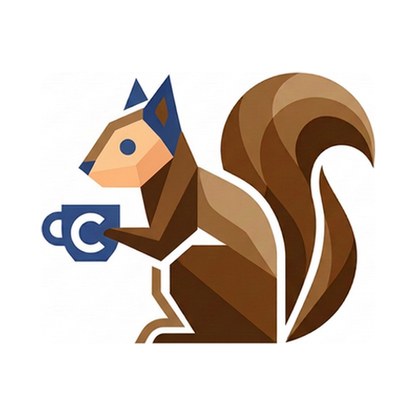

# Portfolio | TerappyLab!

<p align="center">
  
</p>

[Terappy](https://github.com/terappy) のポートフォリオサイトソースコードです。

## 概要

最新のフロントエンド技術を用いて構築された、静的なシングルページアプリケーション（SPA）形式のポートフォリオサイトです。
全体的にダークテーマとグラスモーフィズム（ガラスのような透け感のあるデザイン）を採用し、Framer Motion を用いてリッチで滑らかなアニメーションを実装しています。

- **プレビュー**: [https://terappy.github.io](https://terappy.github.io)

## 利用技術

- **Framework**: [Next.js](https://nextjs.org/) (App Router, React 19)
- **Language**: TypeScript
- **Styling**: [Tailwind CSS](https://tailwindcss.com/)
- **Animation**: [Framer Motion](https://www.framer.com/motion/)
- **Icons**: [Lucide React](https://lucide.dev/)
- **Deployment & Hosting**: GitHub Pages (using GitHub Actions)

## ローカルでの開発と起動

Node.js（>= 18.x）がインストールされている環境で、以下のコマンドを実行してください。

```bash
# パッケージのインストール
npm install

# 開発サーバーの起動
npm run dev
```

ブラウザで `http://localhost:3000` を開くと動作確認が可能です。コード（`src/app/page.tsx` や各コンポーネント）を編集すると自動でリロードされます。

## ディレクトリ構成

- `src/app/`: Next.js のルーティング設定、全体のレイアウト (`layout.tsx`)、およびメインページ (`page.tsx`)。グローバルCSS (`globals.css`)。
- `src/components/`: 各セクションのUIコンポーネント（Hero, AboutMe, Works, SkillSet, History, Header, Footer）。
- `public/`: ファビコンなどの静的ファイル。生成AIで作成したオリジナルファビコン画像の元データ (`assets/favicon_original.png`) も含まれています。
- `.github/workflows/`: GitHub Pages への自動デプロイ設定ファイル (`deploy.yml`)。

## デプロイメント

このリポジトリの `master` または `main` ブランチにコードをプッシュすると、GitHub Actions のワークフロー（`.github/workflows/deploy.yml`）が自動的に実行され、静的ファイルがビルドされた後に GitHub Pages へデプロイされます。手動ビルドや `gh-pages` コマンドラインツールによるデプロイは不要です。

## アセット

- ファビコンに使用しているリスのイラストの元画像は `public/assets/favicon_original.png` に保管されています（生成AIにて作成）。
- アイコンには Lucide React を使用しています。
